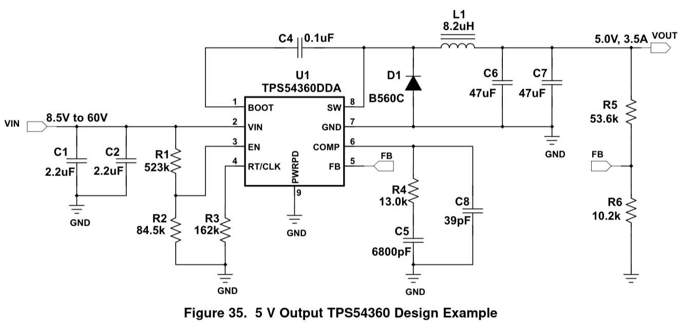
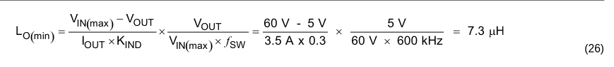
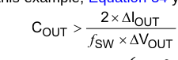

# Buck Converter Externel Component Selection - TPS54360DDAR

**[Datasheet](https://www.lcsc.com/datasheet/C44377.pdf?spm=wm.sxq.inf.ggs&lcsc_vid=FVlYX11URFJWVAJeRgMIVwcDElULXgBQRlFWBFMDFFgxVlNeQ1RcV11RT1NWVjsOAxUeFF5JWBYZEEoBGA4JCwFIFA4DSA%3D%3D)**

## Typical Application

## Use Case Parameter Selection

### Frequency Selection

We will choose our final frequency by first choosing a preliminary frequency using a safety margin on the given minimum on-time and our desired duty cycle:

t_onmin = 142 ns (135 ns with +5% margin)

D = 3V / 48V = t_onmin / t_period

1/t_period = 0.0625 / 142 ns
F = 440140.84507 (440 kHz)

### Inductor Selection
We assume K_ind to be .3 as it is the industry standard for typical use cases. High power management is not critical here as power consumption is quite low in the Samsung SmartTag2

L_O(min) = ([54.6V - 3V] / [5.5A * .3]) * (3V / [54.6V * 440 kHz])

= 0.00000390518 H
= 3.90518 µH
~= 3.9 µH

To achieve the minimum Inductor Size required at this frequency, a **4.7 nH** inductor with an 0805 package is used.

The 0805 standard is chosen out of personal preference.

### Output Capacitor Selection

