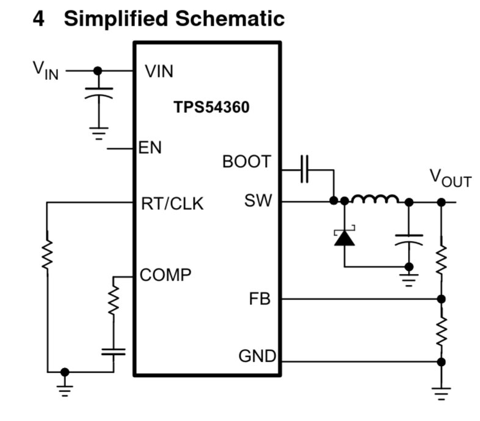

# Component Selection

This document is for the decision-making process for choosing ICs (And external components) and power connectors for this project.

## Requirements

- Must be able to provide power to the Samsung SmartTag2 running at its peak voltage.
- Must still power the scooter during normal operation.
- The SmartTag2 must remain constantly powered
  - Look into low power mode as an option if efficiency is deemed a requirement.
- Board must sit inbetween the main battery and the original battery circuit, without splicing original cable.

### Specification: Samsung [SmartTag2](https://www.samsung.com/us/mobile-accessories/galaxy-smarttag2-black-sku-ei-t5600bbegus/)

- Maximum current bursts of 40 mA
- Designed for 3V operation, but permits up to 3.6V input.
- Natively uses the CR2032 [coin cell battery](https://en.wikipedia.org/wiki/Button_cell)

### Specification: GT1 isinwheel [Off Road Electric Scooter 800W](https://www.isinwheel.eu/products/isinwheel-gt1-off-road-electric-scooter-800w)

- 48V 10Ah Lithium Battery (480Wh) ()
- Uses XT60 battery connectors internally
- 16.67 A continuous expected draw from motor
- Estimate 25 A Peak Draw

## Design Functional Description Requirement

This board will take 48V (nominal) as input through an XT60 connector (Female) and will function as a power tap from the main battery line into the Samsung SmartTag2. The input voltage will pass through an XT60 connector (male) directly to the original female output XT60 connector into the rest of the scooter system.

A sub-circuit will be connected to the main power rails/plane that pass through to the 48V power bus. The subcircuit will attach directly to a buck converter that will output close to the nominal voltage for the Samsung SmartTag2 in order to continuously power the location device whether the scooter is powered on or not.

## Component Requirements

- XT60 Connector Pair XT60PW-F / XT60PW-M
- Buck Converter
  - High Voltage input (At minimum 54.6V)
  - Output Voltage Range: 3V - 3.6V (3V preferred, but optimized 3.3V is okay.)
  - Current Rating: 60mA minimum.

## Component Selection

### Buck Converter - TPS54360DDAR

- **Availability on LCSC**: 15,000 (07-19-2026)
- **LCSC Part #** C44377
- **[Datasheet](https://www.lcsc.com/datasheet/C44377.pdf?spm=wm.sxq.inf.ggs&lcsc_vid=FVlYX11URFJWVAJeRgMIVwcDElULXgBQRlFWBFMDFFgxVlNeQ1RcV11RT1NWVjsOAxUeFF5JWBYZEEoBGA4JCwFIFA4DSA%3D%3D)**
  - **Packaging:** SOIC-8-EP
  - **Vin Range:** 4.5V - 60V
  - **Vout Range:** 0.8V - 58.8V
  - **Max Current:** 3.5 A

#### Simplified Schematic

